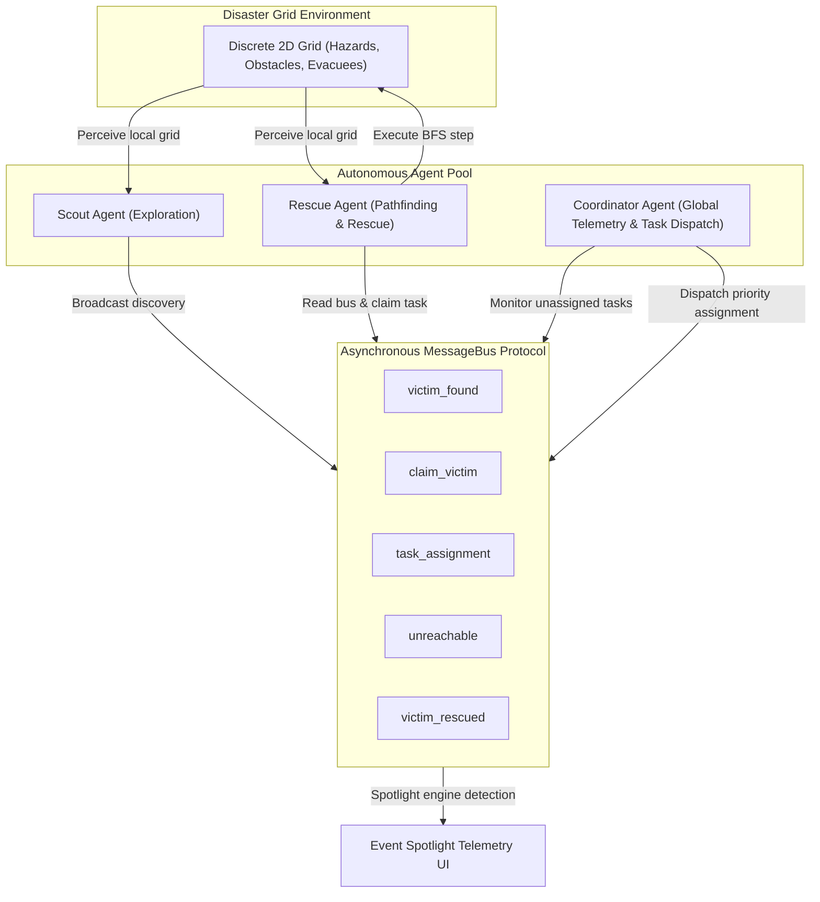

# Multi-Agent Disaster Response — Autonomous Evacuation Simulation

[](https://nextjs.org/)
[](https://reactjs.org/)
[](https://www.typescriptlang.org/)
[](https://tailwindcss.com/)
[](https://supabase.com/)
[](LICENSE)

An academic-grade, visual multi-agent system (MAS) simulation built to demonstrate **decentralized coordination**, **asynchronous message-bus communication**, and **distributed decision-making** during emergency disaster evacuation scenarios.

---

## 🌟 Executive Summary & Academic Abstract

In catastrophic disaster scenarios, centralized command infrastructure frequently degrades due to communication latency, network partitioning, or physical damage. This project models an autonomous **Multi-Agent Disaster Evacuation System** operating on a discrete grid environment $G = (V, E)$ populated with hazardous zones, structural obstacles, and isolated evacuees.

The architecture decouples global control into specialized autonomous agents:
1. **Scout Agents**: Perform environment exploration, obstacle discovery, and victim identification.
2. **Rescue Agents**: Execute shortest-path navigation via Breadth-First Search (BFS) and transport evacuees to safety.
3. **Coordinator Agent**: Monitors unassigned victim discoveries and dispatches targeted task assignments to idle rescuers.
4. **Evacuee Agents**: Represent stationary victims tracking state transitions from endangered to rescued.

All agent interactions are mediated via an asynchronous **MessageBus** protocol implementing a **first-claim-wins conflict resolution algorithm**. The system includes a real-time **Event Spotlight** engine that translates low-level message-bus events into visual telemetry toasts and map cell highlights for clear demonstration during academic walkthroughs.

---

## 🏗️ Multi-Agent System Architecture

### 1. Agent Taxonomy & Perception-Decision-Action (PDA) Loop

Every agent in the simulation implements a three-phase cycle executed on each simulation tick:

$$\text{Perceive}(G, \text{Bus}) \longrightarrow \text{Decide}() \longrightarrow \text{Act}(G, \text{Bus})$$



### 2. Agent Roles & Specifications

| Agent Role | Symbol | Color | Core Responsibilities | Message Bus Interactions |
| :--- | :---: | :---: | :--- | :--- |
| **Scout Agent** | 👁️ | `#22D3EE` (Cyan) | Unexplored grid exploration, hazard detection, victim identification. | Broadcasts `victim_found` |
| **Rescue Agent** | 🛡️ | `#F97316` (Orange) | BFS path calculation, task claiming, navigation, evacuee extraction. | Sends `claim_victim`, `unreachable`, `victim_rescued` |
| **Coordinator Agent** | 📻 | `#FACC15` (Yellow) | Identifies unassigned `victim_found` events and matches them to idle rescuers. | Sends `task_assignment` |
| **Evacuee Agent** | 👤 | `#22C55E` (Green) | Represents trapped civilians requiring rescue assistance. | Receives state change to `rescued` |

---

## 📡 MessageBus & Distributed Conflict Resolution

Communication between agents is strictly decoupled through the [`MessageBus`](file:///C:/Dev/Multi-Agent%20Disaster%20Response/lib/messageBus.ts). Agents do not directly modify each other's internal state.

### Message Schema

```typescript
export interface AgentMessage {
  id: string;
  from: string;
  type: "victim_found" | "claim_victim" | "task_assignment" | "unreachable" | "victim_rescued";
  payload: {
    victimId?: string;
    assignedAgentId?: string;
    x?: number;
    y?: number;
  };
  timestamp: number;
}
```

### First-Claim-Wins Conflict Resolution

When multiple Rescue Agents detect the same `victim_found` message simultaneously:
1. Each Rescue Agent evaluates its BFS path distance to $(x, y)$.
2. The agent sends a `claim_victim` message to the `MessageBus`.
3. Subsequent agents inspecting the bus observe the existing `claim_victim` entry and skip the victim to avoid redundant rescue attempts.
4. If a victim is completely enclosed by obstacles, the Rescue Agent emits an `unreachable` alert.

---

## 🧭 Pathfinding & Grid Dynamics

Pathfinding is powered by a deterministic **Breadth-First Search (BFS)** algorithm in [`lib/pathfinding.ts`](file:///C:/Dev/Multi-Agent%20Disaster%20Response/lib/pathfinding.ts):

- **Grid Graph Representation**: $G = (V, E)$ where $|V| = N \times N$.
- **Walkable Criteria**: A cell $(x, y)$ is walkable if $\text{status} \neq \text{'blocked'}$.
- **Shortest Path Guarantee**: BFS guarantees the optimal shortest path under unweighted unit grid step costs, ensuring efficient rescue operations.

---

## 💡 Event Spotlight & Telemetry Console

Built specifically for academic presentations and live lectures, the **Event Spotlight Engine** ([`lib/spotlightEngine.ts`](file:///C:/Dev/Multi-Agent%20Disaster%20Response/lib/spotlightEngine.ts)) inspects the message log every tick to trigger:

- 🔔 **Claim Conflict Warnings**: Visualizes simultaneous task claims and highlights the winning agent.
- ⚠️ **Unreachable Victim Alerts**: Calls out victims isolated by structural damage.
- ✅ **Rescue Completion Toasts**: Celebrates successful evacuee extractions.
- 🎯 **Map Overlays**: Temporarily highlights target cells on the visual grid.

---

## 📁 Repository Structure

```text
├── app/
│   ├── globals.css         # Custom telemetry theme, animations & Tailwind styles
│   ├── layout.tsx          # Main root layout wrapper
│   └── page.tsx            # Telemetry console dashboard & grid UI
├── components/
│   ├── AgentMarker.tsx     # Animated SVG agent icon overlays
│   ├── BriefingScreen.tsx  # Academic presentation briefing & demo launcher
│   ├── Cell.tsx            # Individual grid cell renderer
│   ├── ConfigPanel.tsx     # Environmental parameter sliders
│   ├── Controls.tsx        # Start, pause, step, reset & speed controls
│   ├── EventSpotlight.tsx  # Live presentation event overlay cards
│   ├── Grid.tsx            # Tactical map rendering container
│   ├── RunHistory.tsx      # Past run metrics table (Supabase/LocalStorage)
│   └── StatsPanel.tsx      # Real-time simulation metrics & message log stream
├── hooks/
│   └── useSimulation.ts    # React state hook binding simulation engine to UI
├── lib/
│   ├── agents/
│   │   ├── BaseAgent.ts        # Abstract base class for all agent types
│   │   ├── CoordinatorAgent.ts # Task distribution logic
│   │   ├── EvacueeAgent.ts     # Civilian target logic
│   │   ├── RescueAgent.ts      # Pathfinding & extraction logic
│   │   └── ScoutAgent.ts       # Exploration & discovery logic
│   ├── demoScenarios.ts    # Seeded scenario configurations for demo mode
│   ├── grid.ts             # Grid generation, hazard placement & bounds checking
│   ├── messageBus.ts       # Centralized asynchronous message bus
│   ├── pathfinding.ts      # BFS shortest path navigation algorithm
│   ├── random.ts           # Seeded pseudo-random number generator (PRNG)
│   ├── simulationEngine.ts # Master tick loop orchestrator
│   ├── spotlightEngine.ts  # Event detection engine for UI callouts
│   ├── stats.ts            # Run metrics tracking & database persistence
│   ├── supabaseClient.ts   # Supabase client initializer
│   └── types.ts            # Shared TypeScript interfaces & types
├── .env.local.example      # Environment variables template
├── eslint.config.mjs       # Next.js flat ESLint 9 configuration
├── next.config.ts          # Next.js framework configuration
├── package.json            # Project dependencies & npm scripts
└── tsconfig.json           # TypeScript strict compiler configuration
```

---

## 🛠️ Quick Start & Installation Guide

### Prerequisites

- **Node.js**: `v18.17.0` or higher
- **npm**: `v9.0.0` or higher

### 1. Clone & Install Dependencies

```bash
git clone https://github.com/adeyemo-taiwo-m/Multi-Agent-Disaster-Response.git
cd Multi-Agent-Disaster-Response
npm install
```

### 2. Configure Environment Variables (Optional for Database Persistence)

Create a `.env.local` file in the root directory (see `.env.local.example`):

```env
NEXT_PUBLIC_SUPABASE_URL=https://your-supabase-project.supabase.co
NEXT_PUBLIC_SUPABASE_ANON_KEY=your-supabase-anon-key
```

> ℹ️ **Note**: If Supabase credentials are omitted, the simulation automatically falls back to **browser LocalStorage** for saving run history, ensuring zero-configuration local usage.

### 3. Run Development Server

```bash
npm run dev
```

Open [http://localhost:3000](http://localhost:3000) in your browser.

### 4. Verification & Build Verification

```bash
# Type check TypeScript files
npx tsc --noEmit

# Run Next.js & ESLint checks
npm run lint

# Production build check
npm run build
```

---

## 🎓 Academic Demo Walkthrough Guide (For Lecturers)

To reliably demonstrate multi-agent coordination during a live presentation:

1. **Launch Demo Mode**:
   - On initial page load, click **Run Demo Scenario** on the **Mission Briefing** screen.
   - This loads a seeded deterministic scenario (`DEMO_SEED`) guaranteeing consistent agent behavior.

2. **Key Coordination Highlights to Point Out**:
   - **Tick 5–15 (Discovery)**: Observe Scout Agents scanning unexplored sectors and broadcasting `victim_found` messages.
   - **Tick 15–30 (Claim Conflict & Resolution)**: Watch Event Spotlight toasts call out multiple Rescue Agents targeting the same victim, demonstrating first-claim-wins resolution.
   - **Tick 30–60 (Coordinator Intervention & Unreachable Handling)**: Point out Coordinator Agents re-assigning unhandled targets and warning toasts when victims are blocked by hazards.
   - **Completion**: Review the **Mission Metrics Panel** showing Total Ticks, Rescue Success Rate, and Message Count.

---

## 🗄️ Database Schema (Supabase SQL)

If connecting to a Supabase database instance, run the following DDL script to create the `simulation_runs` table:

```sql
CREATE TABLE IF NOT EXISTS simulation_runs (
  id UUID PRIMARY KEY DEFAULT gen_random_uuid(),
  grid_size INT NOT NULL,
  victims_total INT NOT NULL,
  victims_rescued INT NOT NULL,
  ticks_taken INT NOT NULL,
  messages_sent INT NOT NULL,
  duration_ms INT NOT NULL,
  created_at TIMESTAMPTZ DEFAULT NOW()
);

-- Enable RLS (Row Level Security)
ALTER TABLE simulation_runs ENABLE ROW LEVEL SECURITY;

-- Allow anonymous read and insert for demonstration purposes
CREATE POLICY "Allow public read access" ON simulation_runs FOR SELECT USING (true);
CREATE POLICY "Allow public insert access" ON simulation_runs FOR INSERT WITH CHECK (true);
```

---

## 🔬 Tech Stack Summary

| Layer | Technology |
| :--- | :--- |
| **Framework** | Next.js 15 (App Router) |
| **Language** | TypeScript 5 (Strict Mode) |
| **UI & Styling** | React 19, Tailwind CSS 3, Lucide Icons |
| **State Management** | Custom React Hooks (`useSimulation`) |
| **Algorithmic Core** | Breadth-First Search (BFS), Seeded PRNG |
| **Database / Storage** | Supabase (PostgreSQL) + LocalStorage Fallback |
| **Deployment Target** | Vercel Edge / Node Runtime |

---

## 📜 License

This project is open-source and released under the [MIT License](LICENSE). Built for educational, research, and academic demonstration purposes.
